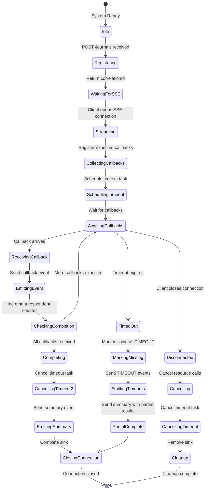
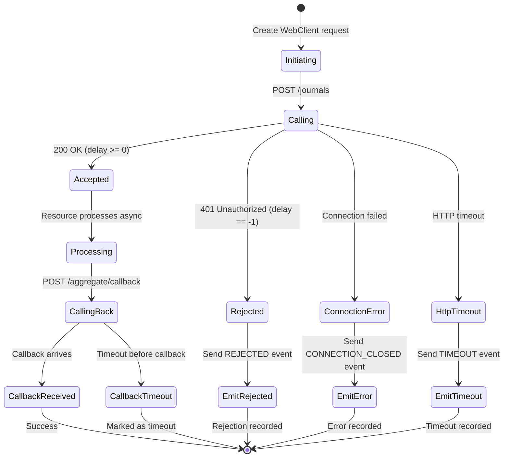
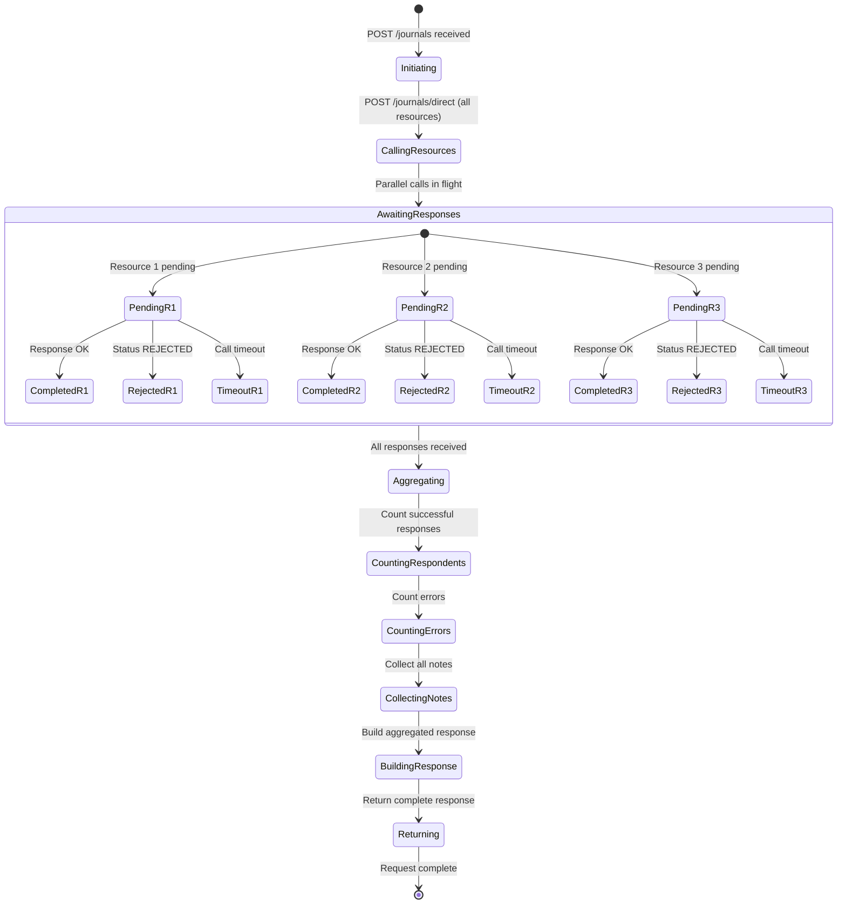
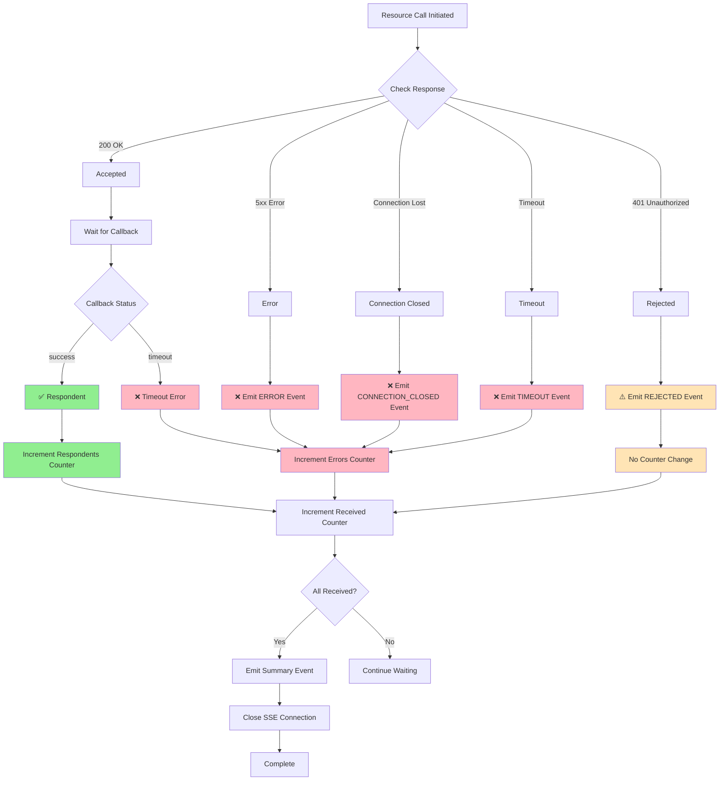
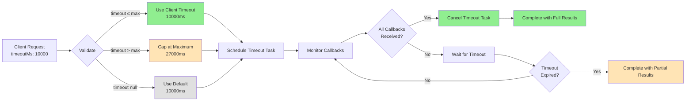
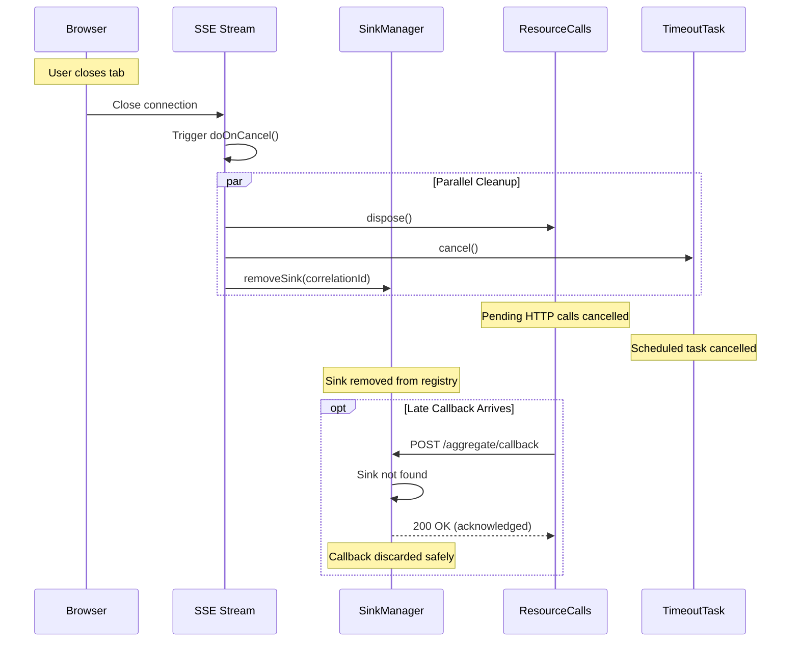
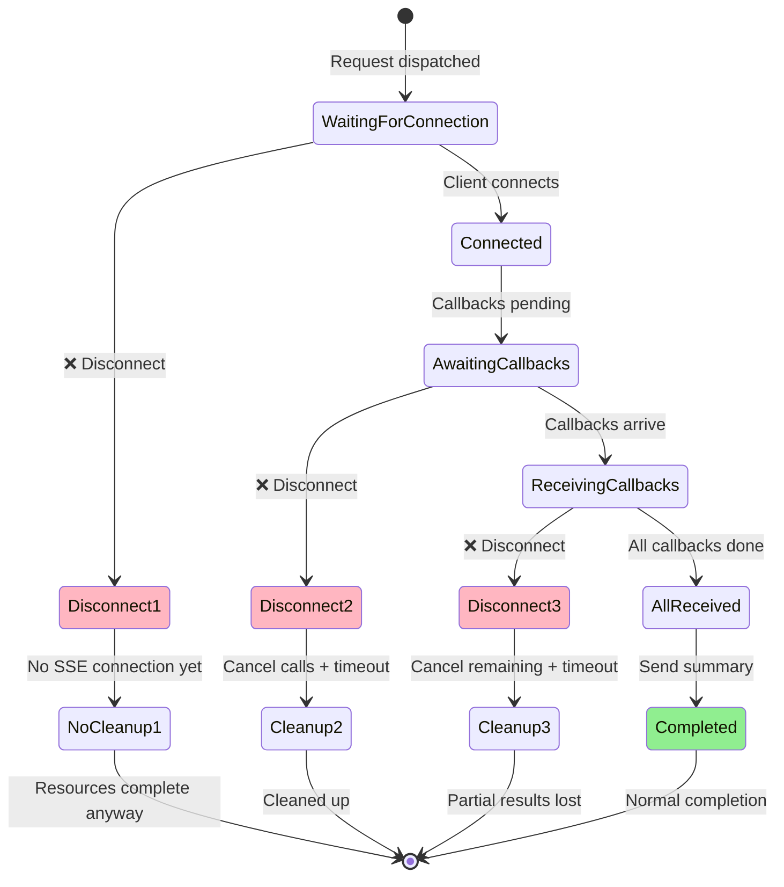
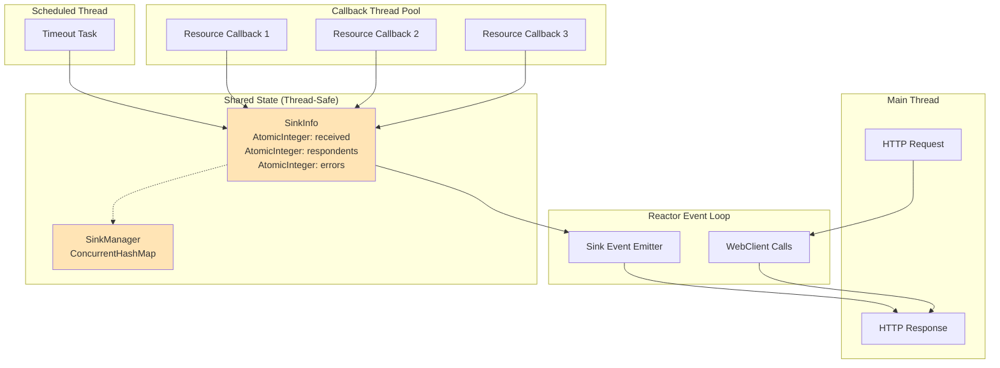
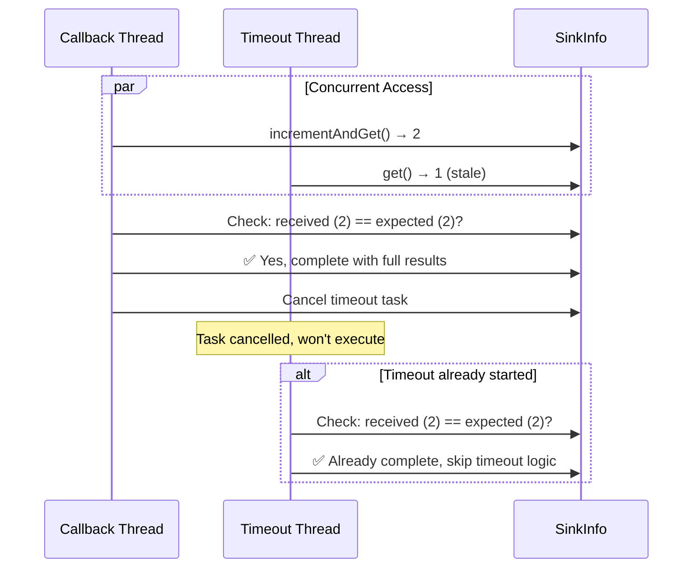

# System State and Error Handling

## System States

This document describes the various states and transitions in the aggregator system.

### SSE Connection Lifecycle



### Resource Call States



### Wait-for-Everyone Strategy States



---

## Error Handling Matrix

### Event Types and Classification

| Event Type | HTTP Status | Counted As | Description | Action |
|------------|-------------|------------|-------------|--------|
| **ok** | 200 | Respondent | Successful callback with notes | Emit callback event, increment respondents |
| **REJECTED** | 401 | Neither | Business rejection (delay=-1) | Emit REJECTED event immediately, don't count as error |
| **TIMEOUT** | N/A | Error | Resource didn't callback in time | Emit TIMEOUT event, increment errors |
| **CONNECTION_CLOSED** | N/A | Error | Connection closed prematurely | Emit CONNECTION_CLOSED event, increment errors |
| **ERROR** | 500+ | Error | Other error conditions | Emit ERROR event, increment errors |

### Error Response Patterns



---

## Timeout Behavior

### Timeline Visualization

```
SSE Strategy (10s timeout, delays: 1000,2000,15000):

T=0ms     Client sends request
T=0ms     Aggregator calls resources in parallel
T=10ms    All resources respond: 200, 200, 200
T=10ms    Aggregator returns {respondents: 3, correlationId: "abc"}
T=20ms    Client opens SSE connection
T=30ms    Timeout task scheduled (10000ms)
          
T=1000ms  Resource-1 POSTs callback
T=1000ms  → SSE event: callback (resource-1, 3 notes)
          
T=2000ms  Resource-2 POSTs callback  
T=2000ms  → SSE event: callback (resource-2, 3 notes)
          
T=10030ms ⏰ TIMEOUT EXPIRES
T=10030ms → SSE event: TIMEOUT (resource-3)
T=10030ms → SSE event: summary (respondents=2, errors=1)
T=10030ms → SSE connection closes
          
T=15000ms Resource-3 POSTs callback (late)
T=15000ms → Sink not found, callback acknowledged but discarded
```

### Timeout Configuration



---

## Client Disconnect Scenarios

### Clean Disconnect Flow



### Disconnect During Various States



---

## Concurrent Access Patterns

### Thread Safety



### Atomic Operations

All counter updates use `AtomicInteger` for thread-safe operations:

```java
// ✅ Thread-safe increment
int currentCount = sinkInfo.getRespondents().incrementAndGet();

// ✅ Thread-safe read
int total = sinkInfo.getReceived().get();

// ✅ Compare total vs. expected
if (received == expectedCallbacks) {
    completeWithSummary();
}
```

### Race Condition Handling

**Scenario**: Timeout expires while callback is being processed



**Protection**: `ScheduledFuture.cancel()` + idempotent completion check

---

## Summary Message Examples

### All Resources Succeed

```json
{
  "source": "AGGREGATOR",
  "patientId": "patient-123",
  "correlationId": "abc-123",
  "status": "COMPLETE",
  "respondents": 3,
  "errors": 0,
  "notes": null
}
```

### One Rejection (401), Two Success

```json
{
  "source": "AGGREGATOR",
  "patientId": "patient-123",
  "correlationId": "abc-123",
  "status": "COMPLETE",
  "respondents": 2,
  "errors": 0,
  "notes": null
}
```

### One Timeout, Two Success

```json
{
  "source": "AGGREGATOR",
  "patientId": "patient-123",
  "correlationId": "abc-123",
  "status": "COMPLETE",
  "respondents": 2,
  "errors": 1,
  "notes": null
}
```

### All Resources Timeout

```json
{
  "source": "AGGREGATOR",
  "patientId": "patient-123",
  "correlationId": "abc-123",
  "status": "COMPLETE",
  "respondents": 0,
  "errors": 3,
  "notes": null
}
```

---

## Monitoring Points

### Key Metrics to Track

1. **Request Metrics**
   - Total requests by strategy (SSE vs. synchronous)
   - Request duration (p50, p95, p99)
   - Timeout rate

2. **Resource Metrics**
   - Response times per resource
   - Success rate per resource
   - Rejection rate (401) per resource
   - Error rate per resource

3. **SSE Metrics**
   - Active SSE connections
   - Connection duration
   - Events emitted per connection
   - Client disconnects

4. **Callback Metrics**
   - Callback latency
   - Late callbacks (after timeout)
   - Callback errors

5. **Error Metrics**
   - Errors by type (TIMEOUT, CONNECTION_CLOSED, ERROR)
   - Error rate trend
   - Partial completion rate

### Health Checks

```java
// Aggregator health
GET /actuator/health
{
  "status": "UP",
  "components": {
    "sseManager": {
      "status": "UP",
      "details": {
        "activeSinks": 5,
        "totalProcessed": 1234
      }
    },
    "resourceConnectivity": {
      "status": "UP",
      "details": {
        "resource-1": "UP",
        "resource-2": "UP",
        "resource-3": "DOWN"
      }
    }
  }
}
```
